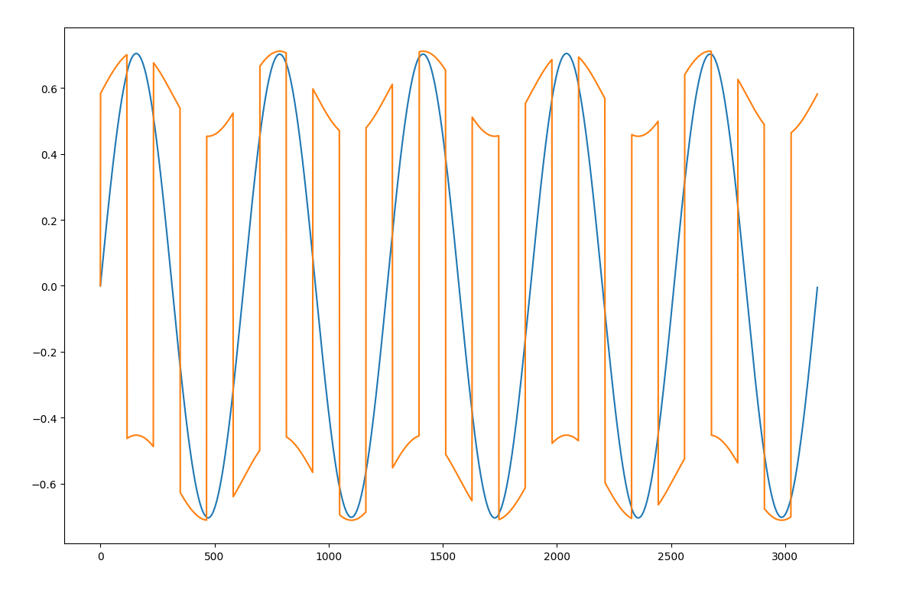
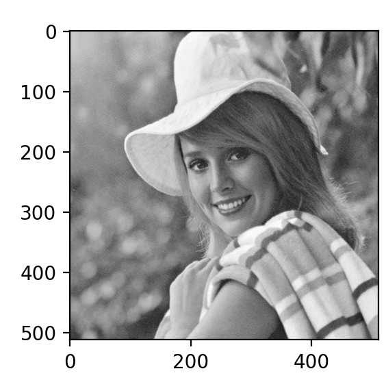
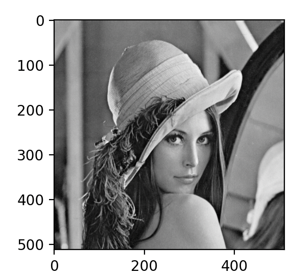

## 


## 導入

講義で扱ったPython言語において、Numpyを用いて独立主成分分析を実装した。

実装したプログラムは添付されているpyファイルに存在する

## 手法・結果

課題のPDFを参照し、白色化をした元でICAを計算する処理を実装した。以下に白色化とICAの計算のそれぞれのPythonプログラム例を書く

```py
import numpy as np 
import matplotlib.pyplot as plt

def whiten(X):
    X = X - X.mean(axis=0)
    cov = np.cov(X, rowvar=False)
    # np.dot(X.T, X) / X.shape[0]

    d, E = np.linalg.eigh(cov)
    D = np.diag(1.0 / np.sqrt(d))
    V = E@D@E.T
    # n_components = X.shape[1]
    # V = V[0:n_components, :]
    X_white = X@V.T
    return X_white
```

```py
def ica(Z, max_iter=5000, tol=0.005):
    Z = whiten(Z)
    n, m = Z.shape
    W = np.random.rand(m, m)
    W /= np.sqrt((W ** 2).sum(axis=0))  # 正規化

    for _ in range(max_iter):
        tmp = Z.T @ ((Z.dot(W) ** 3))
        # delta_W = tmp.mean(axis=0) - 3 * W
        delta_W = tmp / n- 3 * W
        # delta_W = (Z.T.dot((whitened_data.dot(W) ** 3)) / num_samples) - 3 * W
        
        W += 0.1 * delta_W
        W /= np.sqrt((W ** 2).sum(axis=0))

        print(np.average(np.abs(delta_W)))

        if np.average(np.abs(delta_W)) < tol:
            break
    S = Z @ W.T
    return S
```

### 結果(課題１)

これを元に課題１の時系列データを分析するプログラムを作成し（kadai1.py), 解析したところ、以下のような二つの信号に分離することができた.



### 課題２


### 課題３ 

kadai3.pyを実行すると、以下のような2枚の画像を得ることができた。

|画像１|画像２|
| --- | --- |
|  |  |

## 考察
場合によってはうまく分離できないことがあり、二つの画像が混ざっていたり輝度が逆転しているということがあった。これは$W$の初期値のランダム値に影響していると考えられるが、scikit-learnで同様の実験をしてみたところ（kadai3_sklearn.pyなど）、そのようなことは起きなかった. 問題としては$W$の初期値の揺らぎが考えられるが、scikit-learnの実装でも初期値は正規分布のランダム値になっていたため原因究明はできなかった。

同様の理由で課題２については有効な結果が得られなかったため、割愛させていただきます


